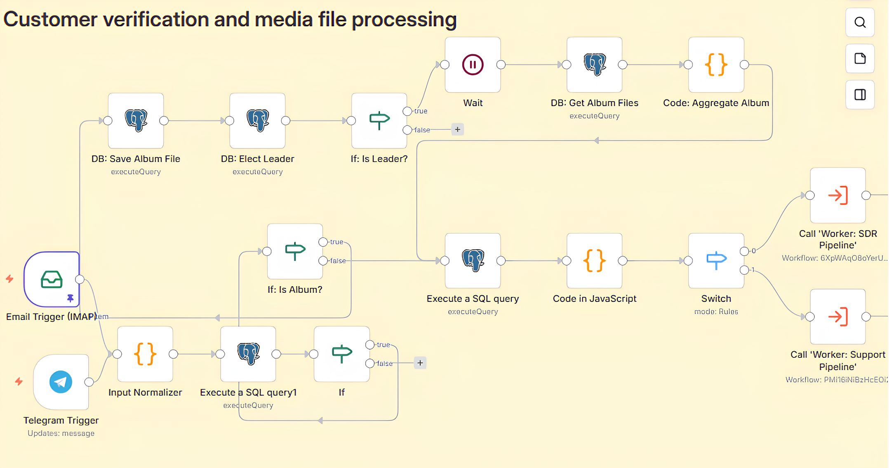
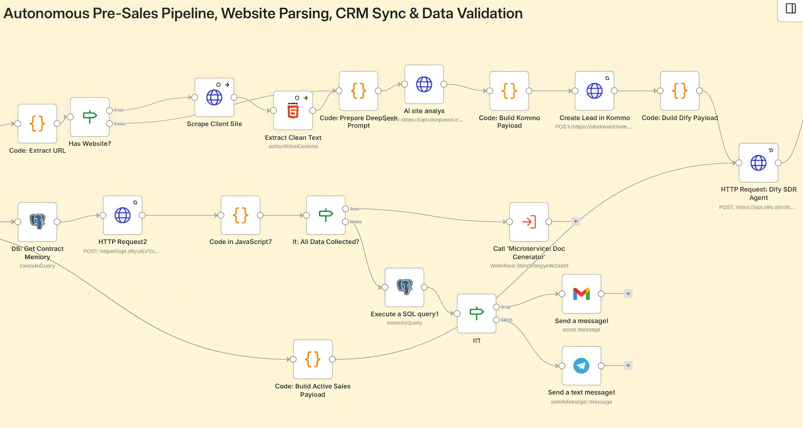
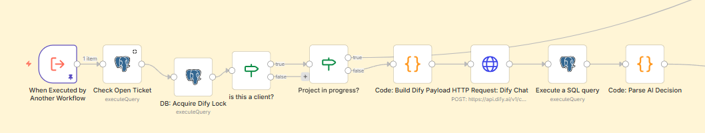
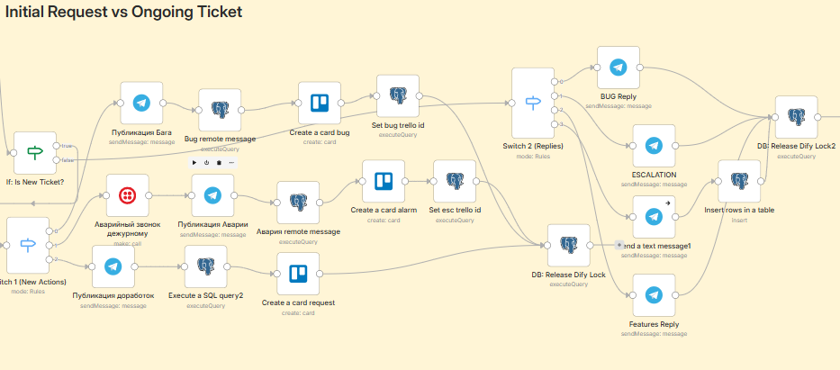

<div align="right">
  <a href="README.md"></a>
  <a href="README.ua.md"></a>
</div>

# Autonomous Agency Framework (AAF)

   

**Autonomous Agency Framework (AAF)** is an event-driven infrastructure for deploying and orchestrating autonomous LLM agents in a real-world B2B business environment.

The project replaces classic departments (Sales, L1/L2 Support) with a network of integrated AI microservices. The system can autonomously parse lead websites, conduct native qualification, manage calendars, and resolve client technical incidents (Zero-Touch Resolution) with automatic escalation to engineers via Trello and IP telephony.

## 🧠 Tech Stack
* **Orchestration:** n8n (Microservice architecture, Sub-workflows).
* **AI Engine:** Dify (DeepSeek / Gemini API).
* **Database:** Neon (Serverless PostgreSQL).
* **Integrations:** Kommo CRM, Trello, Twilio, Google Calendar, Telegram API.
* **Infrastructure:** Docker, Traefik (Auto-SSL).

---

## 🏛 Architecture & Reliability (Enterprise Grade)
The system is designed for high loads and protection against critical failures:
* **Idempotency:** Protection against duplication during repeated webhooks through transactional State Checks in PostgreSQL.
* **Race Condition Protection (Follower > Leader):** Asynchronous media files (e.g., Telegram albums) are intercepted, converted to `base64`, and aggregated into a single Payload via a leader-waiting mechanism, eliminating session context gaps.
* **Timezone Fault Tolerance:** The entire infrastructure is strictly synchronized to UTC, eliminating `dbTime` parsing errors between Node.js and the database during SLA calculations.

---

## 📂 Routing & Microservices (n8n Workflows)

Business logic is divided into isolated Workers triggered by a central API gateway.

### 1. API Gateway (Main Orchestrator)
The single entry point. It validates the Payload, performs SQL verification of the sender (Employee, Lead, Active Client), aggregates files, and routes the data to the appropriate pipeline.


*Pictured: Traffic routing and the Follower > Leader mechanism for processing media files.*

### 2. Autonomous Sales (SDR Pipeline)
The pre-sales unit. Upon receiving a website link from a new lead, the system autonomously parses the web resource, prepares the Payload for the AI, and creates a card in Kommo CRM. It also features a data validation block (via an If node): the system checks the completeness of the gathered information before automatically generating documents (Commercial Proposals).


*Pictured: Lead website analysis, AI Payload preparation, CRM entity creation, and data completeness check for document generation.*

### 3. Tech Support & Operations (Support Pipeline)
Intelligent L1/L2 support system. It works with session history, distinguishes new requests from replies within active tickets, and manages escalations.


*Pictured: Session initialization — user type check and active ticket verification.*


*Pictured: SLA & Escalation Protocol — incident categorization with instant Trello card creation and automatic engineer auto-dialing via Twilio.*

---

## 🤖 AI Agent Infrastructure (Dify)

The system moves away from hard-coded scripts in favor of LLM agents. Agents are restricted by a strict "Anti-Robot Protocol" (no apologies, strict B2B ToV) and utilize external Tools.

### Deployed Roles:
* **Senior B2B SDR:** Conducts qualification using the N.S.S. methodology, extracts business pain points, and evaluates the lead's time/budget losses. Concludes the dialogue by automatically scheduling a video meeting.
* **Technical Account Manager (TAM):** Provides support to active clients. Trained to autonomously grant infrastructure access without engineer involvement.

### Custom Agent Tools (Dify Tools):
The AI can autonomously call internal microservices via API:
1. **Calendar Booker:** Checks managers' Google Calendars and creates Zoom meetings.
2. **Context Enrichment (RAG SQL):** Executes a secure RAG query in PostgreSQL to retrieve sensitive instructions and passwords for a specific client.
3. **Emergency Stop (Kill Switch):** If a client demands an emergency stop, the AI finds the failing workflow's ID in the database and forcefully terminates the process.

---

## 📈 Metrics & Business Impact
1. **Zero-Touch Resolution:** Up to 70% of technical requests are closed autonomously (access provisioning, FAQs).
2. **Instant SLA:** Time from logging a critical bug to calling the on-call engineer is `< 10 seconds`.
3. **Secure Continuous Delivery:** Automated data collection during project releases by engineers (via the `/release` command), completely eliminating the loss of client logins and passwords.

---

## 🛠 Deployment

1. Clone the repository.
2. Configure environment variables based on `.env.example` (API keys are not stored publicly).
3. Spin up the infrastructure:
```bash
docker compose up -d
