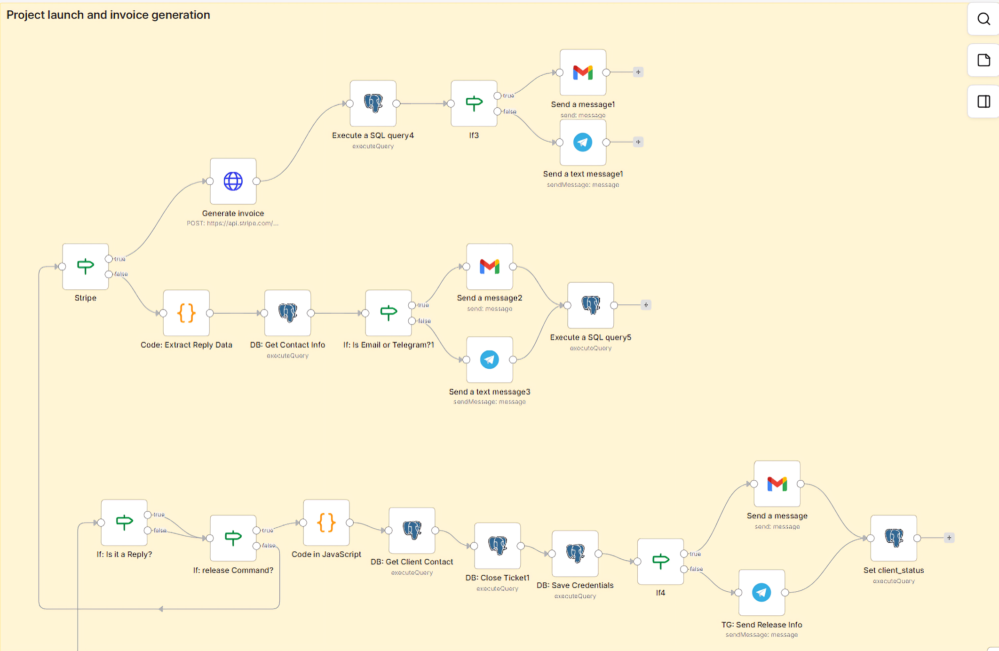

<div align="right">
  <a href="README.md"></a>
  <a href="README.ua.md"></a>
</div>

# Autonomous Agency Framework (AAF)

   

**Autonomous Agency Framework (AAF)** is an event-driven infrastructure for deploying and orchestrating autonomous LLM agents in B2B business environment.

The project replaces classic departments (Sales, L1/L2 Support) with a network of integrated AI microservices. The system can autonomously parse lead websites, conduct native qualification, manage calendars, and resolve client technical incidents (Zero-Touch Resolution) with automatic escalation to engineers via Trello and IP telephony.

## 🧠 Tech Stack
* **Orchestration:** n8n (Microservice architecture, Sub-workflows).
* **AI Engine:** Dify (DeepSeek / Gemini API).
* **Database:** Neon (Serverless PostgreSQL).
* **Integrations:** Kommo CRM, Trello, Twilio, Google Calendar, Telegram API.
* **Infrastructure:** Docker, Traefik (Auto-SSL).

---

## 🏛 Architecture & Reliability (Enterprise Grade)
The system is designed for high loads and protection against critical failures:
* **Idempotency:** Protection against duplication during repeated webhooks through transactional State Checks in PostgreSQL.
* **Race Condition Protection (Follower > Leader):** Asynchronous media files (e.g., Telegram albums) are intercepted, converted to `base64`, and aggregated into a single Payload via a leader-waiting mechanism, eliminating session context gaps.
* **Timezone Fault Tolerance:** The entire infrastructure is strictly synchronized to UTC, eliminating `dbTime` parsing errors between Node.js and the database during SLA calculations.

---

## 📂 Routing & Microservices (n8n Workflows)

Business logic is divided into isolated Workers triggered by a central API gateway.

### 1. API Gateway (Main Orchestrator)
The single entry point. It validates the Payload, performs SQL verification of the sender (Employee, Lead, Active Client), aggregates files, and routes the data to the appropriate pipeline.


*Pictured: Traffic routing and the Follower > Leader mechanism for processing media files.*

### 2. Autonomous Sales (SDR Pipeline)
The pre-sales unit. Upon receiving a website link from a new lead, the system autonomously parses the web resource, prepares the Payload for the AI, and creates a card in Kommo CRM. It also features a data validation block (via an If node): the system checks the completeness of the gathered information before automatically generating documents (Commercial Proposals).


*Pictured: Lead website analysis, AI Payload preparation, CRM entity creation, and data completeness check for document generation.*

### 3. Tech Support & Operations (Support Pipeline)
Intelligent L1/L2 support system. It works with session history, distinguishes new requests from replies within active tickets, and manages escalations.


*Pictured: Session initialization — user type check and active ticket verification.*


*Pictured: SLA & Escalation Protocol — incident categorization with instant Trello card creation and automatic engineer auto-dialing via Twilio.*

### 4. Interactive Events (Callback Router)


A dedicated microservice for handling asynchronous events from messengers (button clicks, replies, and commands). 
* **Feature:** Processes the `/release` command from the engineering team's closed chat, parsing infrastructure credentials and securely saving them to the database for future TAM agent access.

---

## 🗄️ Database Architecture (Neon Serverless)
The framework relies on a relational data model with strict state management. Below is a simplified ER diagram of the core tables:

```mermaid
erDiagram
    leads_pipeline ||--o{ Ticket_messages : generates
    leads_pipeline {
        uuid id
        string contact_id
        string client_status "lead / onboarding / active"
        jsonb contract_data
        text ai_pain_point
    }
    support_tickets ||--o{ Ticket_messages : contains
    support_tickets {
        string ticket_id
        string status
        string category "BUG / ESCALATION / CR"
    }
    Client_credentials {
        string contact_id
        jsonb credentials
    }
